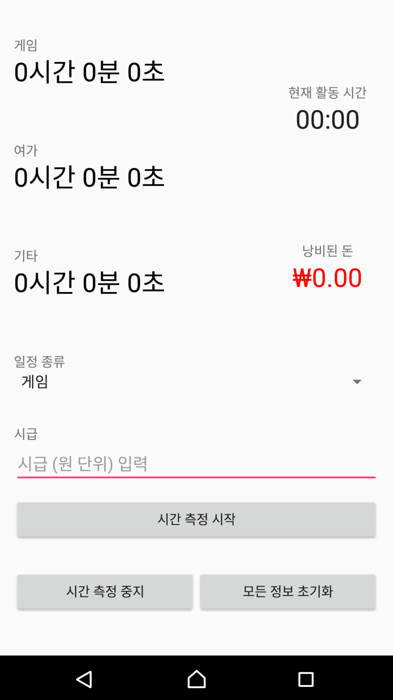

# Time is gold, gold is money, time flies when you're having fun, and you're literally giving out money when you're killing your time

## 시간은 금이고, 금은 돈이고, 재밌게 놀 때 시간은 물 흐르듯 가고, 그리고 시간을 '소비'할 때마다 여러분은 (말 그대로) 돈을 뿌리고 있습니다

..라는 이름을 가진 프로젝트입니다.

## 소개 및 제작 동기

제목이 이 앱의 전체입니다. 이번 프로젝트의 주제인 '소비'에서, 사람들이 매일매일 소비하는 것 중에 하나를 '시간'으로 보았습니다. <i>아직까지는</i> 시간이 무한한 것처럼 보일지 몰라도 결국 사람은 평생 사는 것이 아니고, 지금 보내는 시간은 다시 오지 않으니까요. 

## 간단 기능 소개

일반적인 스톱워치와 여러모로 비슷합니다. 시간을 측정할 수 있고, 측정한 시간동안 무슨 일을 하였는지(게임, 여가 등) 선택할 수 있고, <b>시급을 입력할 수 있습니다</b>. 시간을 돈으로 본 이 앱은, 소모한 시간에 시급을 할당하여 자신이 낭비한 시간을 돈으로 환산하면 얼마가 될 지 알려줍니다. 

## 노력해야 할 점

### 디자인

마감을 향해 달리느라 디자인에 대해 생각할 시간이 없었습니다. 다음에 똑같은 아이디어로 똑같은 애플리케이션을 제작할 기회가 있을지는 모르겠습니다만, 다음번에는 디자인에 더욱 신경을 쓰도록 하겠습니다.

### 2018년식 스파게티 코드

제정신이라면 이러한 코드는 나오지 않았겠죠..?